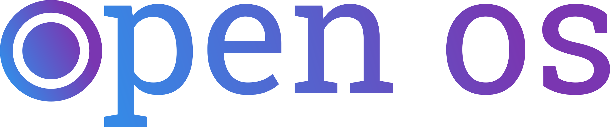

- [Shop Computers](oem)
- [Download](dl)

# Open the Potential of Your Computer

We believe in using powerful technology to enable others to learn, make, and
innovate.

Open OS is a new way to use your laptop or desktop computer. Use fast, simple,
and great looking apps to work, learn, and play.

# Open App Store

Meet the pay-what-you-want Open App Store. Anyone can submit the next big app,
meaning indie devs are free to create and thrive. Find useful tools, handy
applets, and your new favorite ways to get things done.

# Open Source

Open borrows its name&mdash;and core philosophy&mdash;from the [Open Source
Initiative][OSI]. In a nutshell, we believe software should be freely sharable, non-discriminatory, and modifiable for any purpose.

# Get Open OS

Open OS is available out of the box on every new [Example OEM computer][oem], or as
a free download for your current computer.

- [Shop Computers](oem)
- [Download](dl)

[OSI]: https://opensource.org/definition
[oem]: https://example.com
[dl]: #
